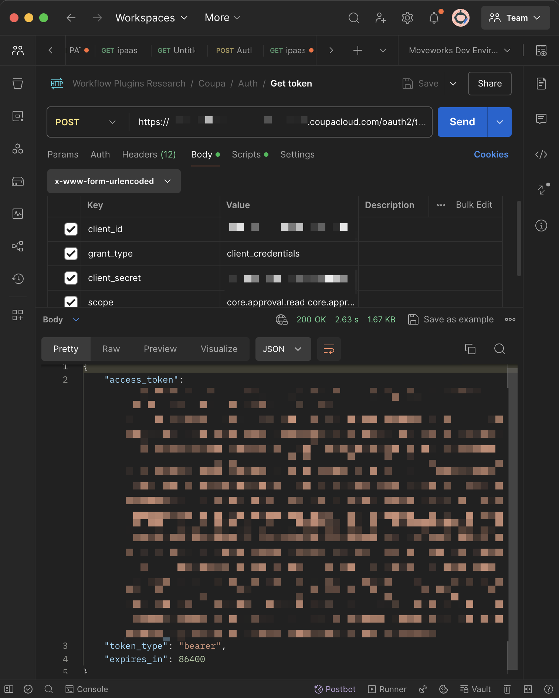
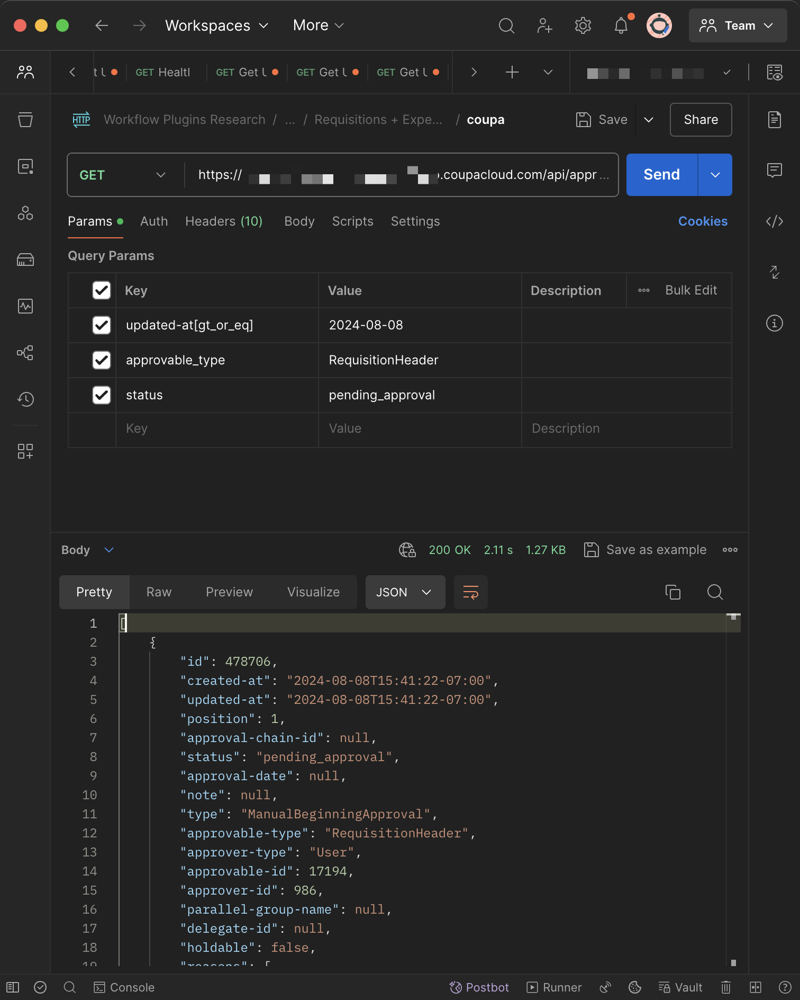
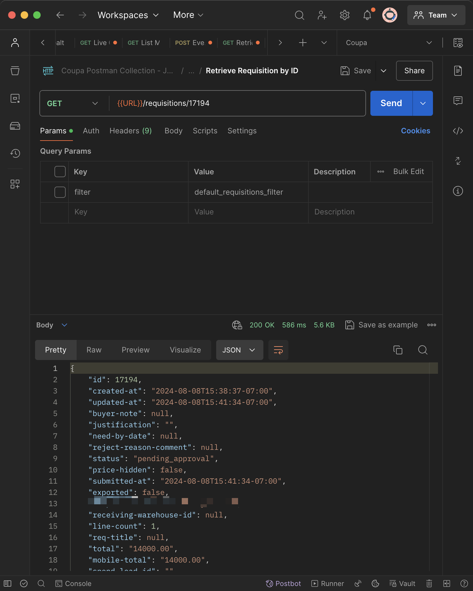
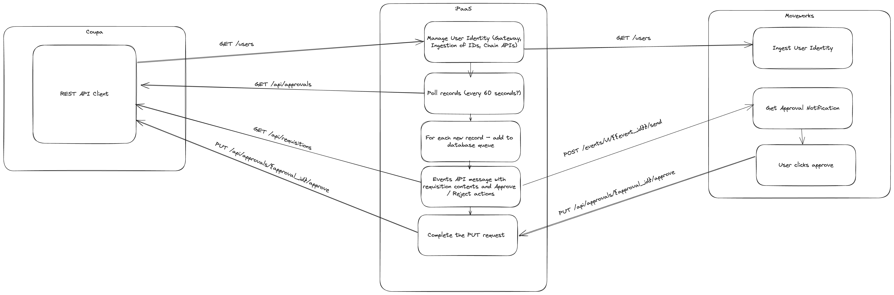

# Stay on top of your purchases with your Copilot 🏝️

Loop in the right approvers at the right time to reduce your cycle time and ensure your purchases are approved on time in Coupa.

Let's dive in!

# Prerequisites

1. Synchronize Coupa user ids from Coupa to Moveworks using [Moveworks Setup](https://help.moveworks.com/docs/ingest-users)
2. Ensure that your Coupa instance uses the same work email as your IDAM. 
3. Review [how to implement a Creator Studio guide with your team](https://developer.moveworks.com/creator-studio/program-management/planning/#how-to-implement-a-creator-studio-guide), and allocate bandwidth for your team or [Moveworks Professional Services](https://developer.moveworks.com/creator-studio/troubleshooting/support/#4-sign-up-for-professional-services) to build the plugin.
4. Ensure that your Coupa administrator has the necessary permissions to configure an API Client for Coupa, and provide the necessary scopes.
5. Connect your middleware and APIM tools with Creator Studio using a [connector](https://developer.moveworks.com/creator-studio/integrations/outbound/connector-configuration/). Follow authentication guides to connect your middleware such as [Azure Function Apps](https://developer.moveworks.com/creator-studio/resources/authentication-guide?id=azure-function-app), [Workato](https://developer.moveworks.com/creator-studio/resources/authentication-guide?id=workato), or [Power Automate](https://powerusers.microsoft.com/t5/Building-Power-Apps/Formatting-a-JSON-response-from-Power-Automate-flow-on-PowerApps/td-p/907563), with Creator Studio. Otherwise, you can learn more about these middleware / APIM tools in our [Program Management docs](https://developer.moveworks.com/creator-studio/program-management/automation-tools/).

# Conversation Design
[This purple chat mock](https://developer.moveworks.com/creator-studio/developer-tools/purple-chat-builder/?workspace=%7B%22title%22%3A%22My+Workspace%22%2C%22botSettings%22%3A%7B%22name%22%3A%22%22%2C%22imageUrl%22%3A%22%22%7D%2C%22mocks%22%3A%5B%7B%22id%22%3A9192%2C%22title%22%3A%22New+Mock%22%2C%22transcript%22%3A%7B%22settings%22%3A%7B%22colorStyle%22%3A%22LIGHT%22%2C%22startTime%22%3A%2211%3A43+AM%22%2C%22defaultPerson%22%3A%22GWEN%22%2C%22editable%22%3Atrue%2C%22botName%22%3A%22%22%2C%22botImageUrl%22%3A%22%22%7D%2C%22messages%22%3A%5B%7B%22from%22%3A%22ANNOTATION%22%2C%22text%22%3A%22%3Cp%3E%3Cb%3ETriggers%3C%2Fb%3E%3Cbr%3E1.+New+approval+queue+detected+while+polling+Coupa%27s+approval+APIs%3Cbr%3E2.+Middleware+initiated+trigger%3Cbr%3E%3Cbr%3E%3Cb%3ESlots%3C%2Fb%3E%3Cbr%3E1.+%3Ci%3EApproval+ID%3C%2Fi%3E%3A+reqired+for+API+actions+to+work%3Cbr%3E%3Cbr%3E%3Cb%3EActions%3C%2Fb%3E%3Cbr%3E1.+%3Ci%3EApprove+requisition%3C%2Fi%3E%3A+Approve+and+move+requisition+to+next+approver+in+requisition+chain%3Cbr%3E2.+%3Ci%3EReject+requisition%3C%2Fi%3E%3A+Reject+requisition+and+move+record+back+to+previous+approver+or+owner%3C%2Fp%3E%22%7D%2C%7B%22from%22%3A%22Bot%22%2C%22text%22%3A%22%3Cp%3EHi+Jamie%2C%3Cbr%3E%3Cbr%3E%3Cb%3E%F0%9F%92%B3+Purchase+Requsition+Pending+Your+Approval%3C%2Fb%3E%3A%3Cbr%3E-+Name%3A+MacBook+Pro+Retina+15%5C%22%3Cbr%3E-+%3Ci%3EQuantity%3C%2Fi%3E%3A+10%3Cbr%3E-+%3Ci%3ECreated+by%3C%2Fi%3E%3A+Sam+Stinson%3Cbr%3E-+%3Ci%3EAmount%3C%2Fi%3E%3A+USD+14060.41%3Cbr%3E-+%3Ci%3ELast+Comment%3C%2Fi%3E%3A+Approved+by+IT+team%2C+waiting+Jamie%27s+approval%3Cbr%3E-+%3Ci%3EApproval+Status%3C%2Fi%3E%3A+Pending+Approval%3Cbr%3E-+%3Ci%3ERequisition+ID%3C%2Fi%3E%3A+14170%3C%2Fp%3E%22%2C%22cards%22%3A%5B%7B%22buttons%22%3A%5B%7B%22style%22%3A%22PRIMARY%22%2C%22text%22%3A%22Approve%22%7D%2C%7B%22text%22%3A%22Send+Back%22%7D%5D%7D%5D%7D%5D%7D%7D%5D%7D) shows the experience we are going to build.

# Discovery Questions to Personalize Your Conversation Design

1. What fields would you like to show inside the approval request notification?
2. Which actions would you like the approver to be able to take on the notification?
3. Do you want approvers to be re-notified if they have not acted on the request within a certain timeframe?
    * This guide only shows configuration instructions for a one-time notification. You will need to customize your middleware code to support repeated notifications.

# Coupa Configuration

Please review the [Coupa Connector](https://developer.moveworks.com/creator-studio/resources/authentication-guide?id=coupa) guide to ensure you have an API client configured for our approvals APIs.

# For Creator Studio Developers

## Step 1: Check you have built a Creator Studio Connector for your middleware / APIM tool

This step was outlined in the Prerequisites section above, and should be completed before you begin building your plugin. If you do not have a connector for your middleware tool, you can learn more about how to build one in our [Connector Configuration Guide](https://developer.moveworks.com/creator-studio/integrations/outbound/connector-configuration/).

## Step 2: Test required APIs with Postman

Copy the cURL commands below into your API client like Postman for testing. Substitute any `{{placeholder text}}` with relevant Coupa API credentials or inputs.

**API 1: Authorization**

```bash
curl --location 'https://{{instance}}.coupacloud.com/oauth2/token' \
--header 'Content-Type: application/x-www-form-urlencoded' \
--data-urlencode 'client_id={{client_id}}' \
--data-urlencode 'grant_type=client_credentials' \
--data-urlencode 'client_secret={{client_secret}}' \
--data-urlencode 'scope=core.approval.read core.approval.write  core.invoice.approval.bypass core.invoice.approval.write core.invoice.assignment.read core.invoice.assignment.write core.invoice.create core.invoice.delete core.invoice.read core.invoice.write core.requisition.read core.user_group.read core.user.read core.purchase_order.write core.purchase_order.read core.expense.read core.expense.secure.read'
```

Expected response:
```json
{
    "access_token": "REDACTED",
    "token_type": "bearer",
    "expires_in": 86400
}
```



**API 2: Get Approvals**

```bash
curl --location --globoff 'https://{{org}}.coupacloud.com/api/approvals?updated-at[gt_or_eq]=2024-08-08&approvable_type=RequisitionHeader&status=pending_approval' \
--header 'Authorization: Bearer {{coupa_auth_token}}' \
--header 'Accept: application/json' \
```



**API 3: Get Requisition**

```bash
curl --location 'https://{{org}}.coupacloud.com/api/requisitions/17194' \
--header 'Authorization: Bearer {{coupa_auth_token}}' \
```



**API 4: Moveworks Events API**

Please replace the `email@example.com` with the email address of the user who will receive the notification.

You can get the `{{moveworks_event_id}}` and `{{moveworks_events_api_key}}` from following the quickstart guide [here](https://developer.moveworks.com/creator-studio/quickstart/event-triggered-paths/).

```bash
curl --location 'https://api.moveworks.ai/rest/v1/events/{{moveworks_event_id}}/messages/send' \
--header 'Authorization: Bearer {{moveworks_events_api_key}}' \
--header 'Content-Type: application/json' \
--data-raw '{
    "message": "💸 New Coupa Expense Report\n",
    "recipients": [
        "email@example.com"
    ]
}'
```

## Step 3: Write your Orchestration Code in your iPaaS

Here is an example of the code you can use to orchestrate the API calls to submit requisition approval notifications and collect approvals in Coupa. 



There are three steps to supporting approvals in Coupa:

1. Polling for new approvals (by default, every 60 seconds)
2. For each new approval, fetch requisition details via the GET Requisitions API
3. Send a notification to Moveworks with the requisition details and slots to approve or reject the requisition

It is deployed as a Python FastAPI application on a server on Azure Virtual Network. You can modify this code to work with your middleware.

### Example iPaaS Code (with Python and FastAPI)

```python
import os
import time
import json
from typing import Dict, List, Optional
from datetime import datetime, timedelta
import sqlite3
from contextlib import asynccontextmanager
import asyncio
import httpx
from dotenv import load_dotenv
from fastapi import FastAPI, HTTPException, Depends, Request, BackgroundTasks
from urllib.parse import urlencode
from fastapi.responses import JSONResponse
from pydantic import BaseModel, Field

# Load environment variables
load_dotenv()

# Config
COUPA_CLIENT_ID = os.getenv("coupa_client_id")
COUPA_CLIETN_SECRET = os.getenv("coupa_client_secret")
COUPA_SCOPES = os.getenv("coupa_scopes")
COUPA_BASE_URL = os.getenv("coupa_base_url")
MOVEWORKS_BASE_URL = "https://api.moveworks.ai"
DATABASE_NAME = "pending_approvals.db"
EVENT_ID = os.getenv("event_id")
EVENT_API_KEY = os.getenv("event_api_key")
POLLING_INTERVAL = 60  # number of seconds to wait between polling

# Global variable to store the token and its expiration time
oauth_token = None
token_expiration_time = None


# Database setup
def init_db():
    conn = sqlite3.connect(DATABASE_NAME)
    cursor = conn.cursor()
    cursor.execute(
        """
        CREATE TABLE IF NOT EXISTS pending_approvals (
            approval_id TEXT PRIMARY KEY,
            submit_date TEXT
        )
    """
    )
    conn.commit()
    conn.close()


init_db()


# Pydantic models for request validation
class NotificationContext(BaseModel):
    approval_id: str
    requisition_id: str


class NotificationRequest(BaseModel):
    message: str = Field(..., min_length=1)
    recipients: List[str] = Field(..., min_items=1)
    context: Optional[NotificationContext] = None


# Helper functions
async def get_coupa_oauth_token() -> str:
    global oauth_token, token_expiration_time

    # Check if the token is still valid
    if (
        oauth_token
        and token_expiration_time
        and time.time() < token_expiration_time
    ):
        return oauth_token

    url = f"{COUPA_BASE_URL}/oauth2/token"
    headers = {
        "Content-Type": "application/x-www-form-urlencoded",
    }
    data = {
        "client_id": COUPA_CLIENT_ID,
        "client_secret": COUPA_CLIETN_SECRET,
        "grant_type": "client_credentials",
        "scope": COUPA_SCOPES,
    }

    async with httpx.AsyncClient() as client:
        response = await client.post(url, headers=headers, data=data)

    if response.status_code != 200:
        raise HTTPException(
            status_code=response.status_code,
            detail="Failed to obtain OAuth token from Coupa",
        )

    response_data = response.json()
    oauth_token = response_data["access_token"]
    expires_in = response_data.get(
        "expires_in", 3600
    )  # Default to 1 hour if not specified
    token_expiration_time = time.time() + expires_in

    return oauth_token


def read_pending_approvals():
    conn = sqlite3.connect(DATABASE_NAME)
    cursor = conn.cursor()
    cursor.execute("SELECT approval_id, submit_date FROM pending_approvals")
    results = cursor.fetchall()
    conn.close()
    return {row[0]: row[1] for row in results}


def write_pending_approval(approval_id, submit_date):
    conn = sqlite3.connect(DATABASE_NAME)
    cursor = conn.cursor()
    cursor.execute(
        "INSERT OR REPLACE INTO pending_approvals (approval_id, submit_date) VALUES (?, ?)",
        (approval_id, submit_date),
    )
    conn.commit()
    conn.close()


def remove_pending_approval(approval_id):
    conn = sqlite3.connect(DATABASE_NAME)
    cursor = conn.cursor()
    cursor.execute(
        "DELETE FROM pending_approvals WHERE approval_id = ?", (approval_id,)
    )
    conn.commit()
    conn.close()
    print(f"Approval {approval_id} removed from pending approvals")


def is_approval_pending(approval_id, submit_date):
    conn = sqlite3.connect(DATABASE_NAME)
    cursor = conn.cursor()
    cursor.execute(
        "SELECT submit_date FROM pending_approvals WHERE approval_id = ?",
        (approval_id,),
    )
    result = cursor.fetchone()
    conn.close()
    is_pending = result is not None and result[0] == submit_date
    print(f"Approval {approval_id} in pending approvals: {is_pending}")
    return is_pending


async def make_request(
    method: str,
    url: str,
    headers: Dict = None,
    data: Optional[Dict] = None,
    auth_type: str = "Bearer",
) -> Dict:
    if headers is None:
        headers = {}

    # Set the Accept header to application/json if not already set
    headers.setdefault("Accept", "application/json")

    if auth_type == "Bearer":
        # Get the OAuth token and add it to the headers
        token = await get_coupa_oauth_token()
        headers["Authorization"] = f"Bearer {token}"
    elif auth_type == "api_key":
        # Use the API key directly
        headers["Authorization"] = EVENT_API_KEY

    async with httpx.AsyncClient() as client:
        if method == "GET":
            response = await client.get(url, headers=headers)
        elif method == "POST":
            response = await client.post(url, headers=headers, json=data)
        elif method == "PUT":
            response = await client.put(url, headers=headers, json=data)
        else:
            raise ValueError(f"Unsupported HTTP method: {method}")

    if response.status_code not in [200, 204]:
        raise HTTPException(
            status_code=response.status_code,
            detail=f"API request failed: {response.text}",
        )

    return (
        response.json()
        if response.status_code == 200
        else {"status": "success"}
    )
    return (
        response.json()
        if response.status_code == 200
        else {"status": "success"}
    )


async def get_pending_approvals() -> Dict:
    base_url = f"{COUPA_BASE_URL}/api/approvals"

    timestamp = datetime.now().strftime("%Y-%m-%d")

    params = {
        "status": "pending_approval",
        "approvable_type": "RequisitionHeader",
        "updated-at[gt_or_eq]": timestamp,
    }

    # Construct the URL with query parameters
    url = f"{base_url}?{urlencode(params)}"

    headers = {"Accept": "application/json"}

    return await make_request("GET", url, headers=headers)


async def get_requisition_status(requisition_id: str) -> Dict:
    url = f"{COUPA_BASE_URL}/api/requisitions/{requisition_id}"
    return await make_request("GET", url)


async def approve_coupa_approval(approval_id: str) -> Dict:
    url = f"{COUPA_BASE_URL}/api/approvals/{approval_id}/approve"
    return await make_request("PUT", url)


async def reject_coupa_approval(
    approval_id: str, reason: Optional[str] = "Reject%20through%20API"
) -> Dict:
    url = f"{COUPA_BASE_URL}/api/approvals/{approval_id}/reject"
    if reason:
        url += f"?reason={reason}"
    return await make_request("PUT", url)


async def send_moveworks_message(
    message: str,
    recipients: List[str],
    context: Optional[NotificationContext] = None,
) -> Dict:
    url = f"{MOVEWORKS_BASE_URL}/rest/v1/events/{EVENT_ID}/messages/send"
    headers = {
        "Content-Type": "application/json",
    }

    payload = {
        "message": message,
        "recipients": recipients,
    }

    if context and context.approval_id and context.requisition_id:
        payload["context"] = {
            "slots": {
                "approval_id": context.approval_id,
            }
        }

    return await make_request(
        "POST", url, headers, payload, auth_type="api_key"
    )


def format_notification_message(requisition):
    approvals = requisition.get("approvals", [])
    current_approval = next(
        (a for a in approvals if a["status"] == "pending_approval"), None
    )

    if current_approval:
        approver = current_approval["approver"]["fullname"]
    else:
        approver = "Unknown"

    return (
        f"<b>📝 Coupa Approval Pending</b>:\n"
        f"- <i>Requisition ID</i>: {requisition['id']}\n"
        f"- <i>Submitted By</i>: {requisition['created-by']['fullname']}\n"
        f"- <i>Submit Date</i>: {requisition['submitted-at']}\n"
        f"- <i>Total Amount</i>: {requisition['total']} {requisition['currency']['code']}\n"
        f"- <i>Requisition Status</i>: {requisition['status']}\n"
        f"- <i>Current Approver</i>: {approver}\n"
        f"- <i>Items</i>: {'\n, '.join(line['description'] for line in requisition['requisition-lines'])}\n"
    )


@asynccontextmanager
async def lifespan(app: FastAPI):
    # Startup logic
    print("Starting up...")
    try:
        # Create the polling task
        polling_task = asyncio.create_task(continuous_polling())
        print("Continuous polling task started successfully")
        yield
    finally:
        # Shutdown logic
        print("Shutting down...")
        # Cancel the polling task if it's still running
        polling_task.cancel()
        try:
            await polling_task
        except asyncio.CancelledError:
            print("Polling task cancelled")


app = FastAPI(lifespan=lifespan)


async def continuous_polling():
    while True:
        try:
            await poll_approvals()
        except Exception as e:
            print(f"Error in continuous polling: {str(e)}")
        await asyncio.sleep(POLLING_INTERVAL)


async def poll_approvals():
    print("Polling for new approvals...")
    try:
        approvals = await get_pending_approvals()

        if isinstance(approvals, list):
            approvals_list = approvals
        elif isinstance(approvals, dict):
            approvals_list = approvals.get("approvals", [])
        else:
            print(
                f"Unexpected type returned by get_pending_approvals: {type(approvals)}"
            )
            return

        for approval in approvals_list:
            approval_id = approval["id"]
            requisition_id = approval["approvable-id"]
            submit_date = approval["updated-at"]
            print(
                f"Checking approval ID: {approval_id}, Approvable ID: {requisition_id}, Submit Date: {submit_date}"
            )

            try:
                if submit_date and not is_approval_pending(
                    approval_id, submit_date
                ):
                    print(
                        f"New approval detected with ID: {approval_id}. Fetching requisition details..."
                    )

                    # Fetch requisition details
                    requisition = await get_requisition_status(requisition_id)

                    print(
                        f"Sending notification for Requisition ID: {requisition_id}"
                    )
                    # Send notification and add approval to pending list
                    await send_moveworks_message(
                        format_notification_message(requisition),
                        ["email@example.com"], # Replace requistion["created-by"]["email"] with the email address of the user who will receive the notification
                        NotificationContext(
                            approval_id=str(approval_id),
                            requisition_id=str(requisition_id),
                        ),
                    )
                    write_pending_approval(approval_id, submit_date)
                else:
                    print(
                        f"Approval ID: {approval_id} is already pending, no action taken."
                    )
            except Exception as e:
                print(f"Error processing approval ID {approval_id}: {str(e)}")

    except Exception as e:
        print(f"Error in polling approvals: {str(e)}")


@app.get("/")
async def health_check():
    return {"status": "ok"}


@app.get("/approvals")
async def get_approvals():
    try:
        pending_approvals = await get_pending_approvals()

        return {"data": pending_approvals}
    except Exception as e:
        return JSONResponse(status_code=400, content={"error": str(e)})


@app.post("/notifications")
async def send_notification(
    request: NotificationRequest, background_tasks: BackgroundTasks
):
    try:
        await send_moveworks_message(
            request.message, request.recipients, request.context
        )
        return {"status": "notification_sent"}
    except Exception as e:
        return JSONResponse(status_code=400, content={"error": str(e)})


@app.post("/approvals/{approval_id}/approve")
async def approve_approval(approval_id: str):
    try:
        await approve_coupa_approval(approval_id)
        remove_pending_approval(approval_id)
        return {"status": "approved"}
    except Exception as e:
        return JSONResponse(status_code=400, content={"error": str(e)})


@app.post("/approvals/{approval_id}/reject")
async def reject_approval(approval_id: str, reason: Optional[str] = None):
    try:
        await reject_coupa_approval(approval_id, reason)
        remove_pending_approval(approval_id)
        return {"status": "rejected"}
    except Exception as e:
        return JSONResponse(status_code=400, content={"error": str(e)})
```

## Step 4: Build in Creator Studio

Follow our [Quickstart Guide](https://developer.moveworks.com/creator-studio/quickstart/event-triggered-paths/) to build an event with followup actions in Creator Studio, which can be called from your middleware.

# Congratulations!

You just gave your employees the ability to approve requisition requests through your Copilot. Look at our other Coupa use cases below to further improve their experience below, and get inspired on what to build next.